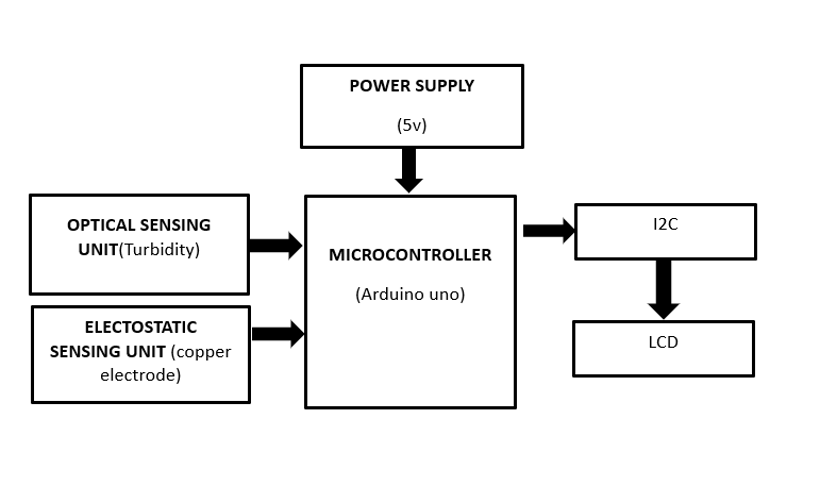
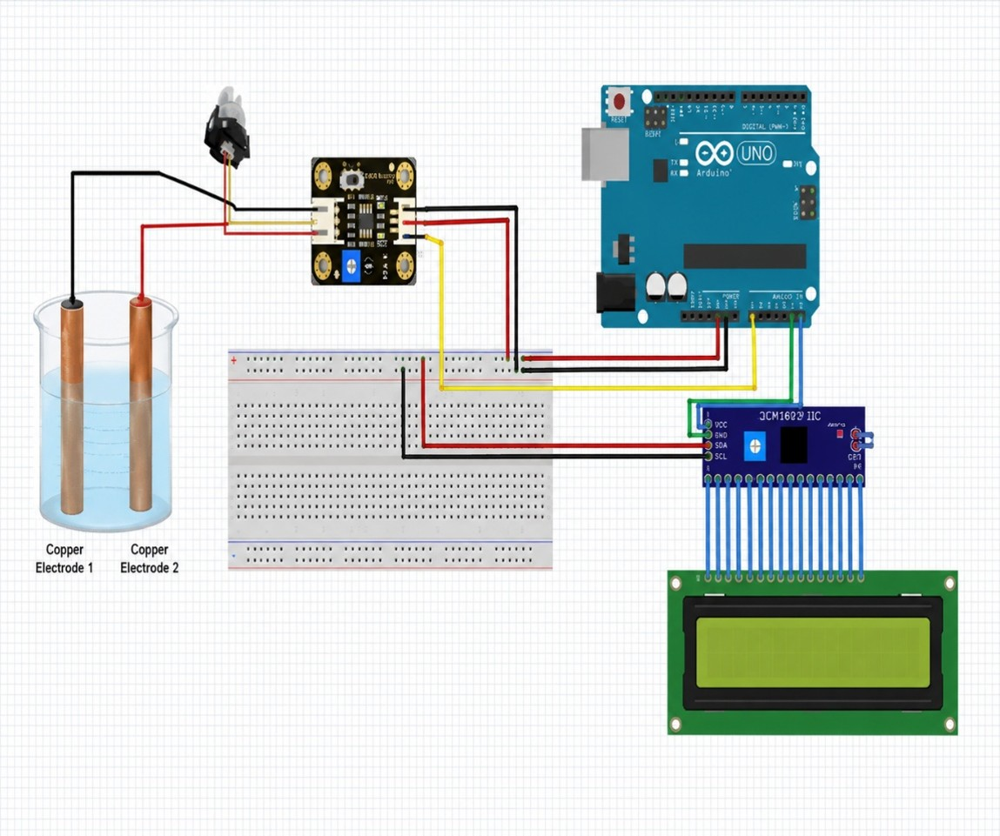
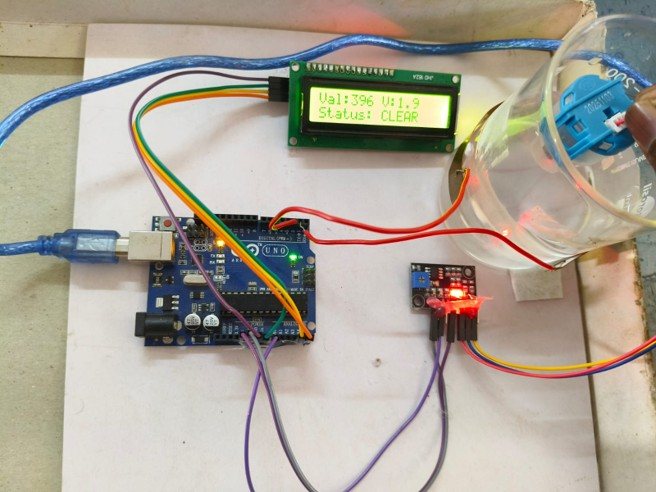
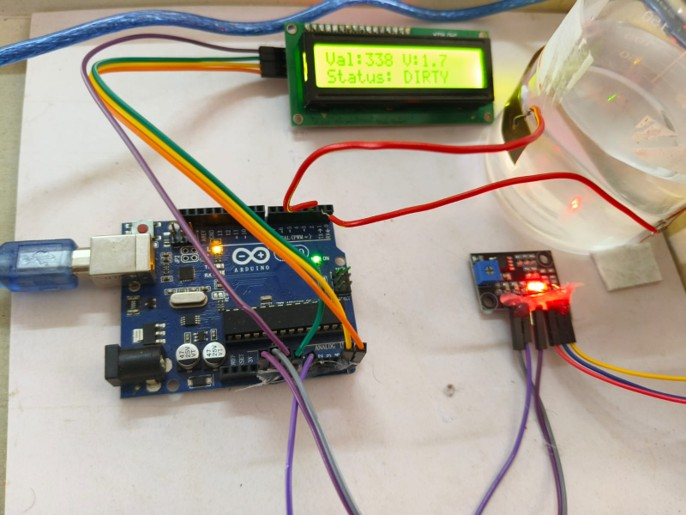

# Portable-Microplastic-Detection-Device-Using-Electrostatic-and-Optical-Sensors

The system detects microplastic contamination in water using electrostatic sensing and optical light scattering techniques. The device provides real-time monitoring, classifies contamination levels into LOW, MEDIUM, and HIGH conditions, and supports portable environmental monitoring applications.

---

# Portable Microplastic Detection Device Using Electrostatic and Optical Sensors

A low-cost and portable real-time microplastic detection system developed using Arduino UNO, copper electrodes, IR optical sensing, and LCD display for environmental monitoring applications.

---

# Project Overview

Microplastic pollution has become a major environmental challenge due to the increasing presence of plastic particles in rivers, lakes, oceans, industrial wastewater, and marine ecosystems. Existing laboratory-based detection techniques such as FTIR and Raman Spectroscopy are expensive, time-consuming, and require skilled operation in laboratory environments.

This project proposes:
- Real-time microplastic detection
- Electrostatic sensing
- Optical light scattering detection
- Portable environmental monitoring
- LCD contamination level display
- Low-cost implementation

The proposed system improves environmental monitoring efficiency and supports pollution control initiatives using simple and affordable hardware components.

---

# Features

- Real-time microplastic detection
- Electrostatic sensing using copper electrodes
- Optical light scattering technique
- Arduino UNO based signal processing
- LOW / MEDIUM / HIGH contamination indication
- Portable and compact design
- Low-cost implementation
- Easy hardware setup
- Suitable for field deployment
- Low power consumption
- LCD display output
- Dual sensing technique for improved reliability

---

# Components Used

| S.No | Component |
|------|-----------|
| 1 | Arduino UNO |
| 2 | Copper Electrodes |
| 3 | IR LED |
| 4 | LDR / Optical Sensor |
| 5 | 16x2 I2C LCD Display |
| 6 | LM358 Operational Amplifier |
| 7 | Jumper Wires |
| 8 | Water Sample Chamber |
| 9 | 5V Power Supply |

---

# Working Principle

1. Water sample enters the sensing chamber.
2. Copper electrodes detect electrostatic charge variations caused by microplastic particles.
3. IR LED emits light through the water sample.
4. Microplastic particles scatter light.
5. Optical sensor detects light intensity variations.
6. Arduino UNO processes both sensor outputs.
7. The system classifies contamination levels into:
   - LOW
   - MEDIUM
   - HIGH
8. LCD display shows contamination status in real time.

---

# Proposed Solution

The proposed system combines electrostatic sensing and optical light scattering techniques for detecting suspended microplastic particles in water samples. Copper electrodes are used to detect charge variations caused by microplastic particles, while an IR LED and optical sensor arrangement identifies light scattering variations in water. The sensor outputs are processed using Arduino UNO for real-time contamination monitoring. The system provides a low-cost, portable, and efficient alternative to expensive laboratory-based detection methods.

---

# Block Diagram

---

# Circuit Diagram

---

# Project Images

## Hardware Setup

## LCD Output

---

# Software Used

- Arduino IDE
- Embedded C Programming

---

# Technologies Used

- Embedded Systems
- Sensor Technology
- Electrostatic Sensing
- Optical Sensing
- Arduino Programming
- Environmental Monitoring

---

# Applications

## Industrial Effluent Monitoring
Plastic, textile, and recycling industries discharge wastewater containing microplastics. The proposed system helps monitor contamination levels before wastewater discharge into the environment.

## Marine & Coastal Pollution Surveillance
The device can be used in rivers, lakes, coastal areas, and marine environments for real-time microplastic monitoring and environmental research applications.

---

# Advantages

- Low-cost alternative to laboratory-based methods
- Portable and lightweight design
- Real-time detection capability
- Easy to operate and maintain
- No expensive spectroscopy equipment required
- Suitable for field-level environmental monitoring
- Combines optical and electrostatic sensing techniques
- Low power consumption
- Compact hardware implementation
- Fast response time
- Supports portable pollution monitoring applications

---

# Limitations

- Detection accuracy depends on sensor calibration
- Turbid water conditions may affect optical sensing
- Difficult to identify exact plastic material type
- Electrostatic sensing may be affected by environmental noise

---

# Output

The system successfully:
- Detects microplastic particles in water
- Measures electrostatic and optical variations
- Displays contamination level on LCD
- Supports real-time environmental monitoring
- Provides portable low-cost detection solution
- Enables field-level water quality analysis

---

# Future Enhancements

- IoT-based wireless monitoring
- AI-based contamination analysis
- Cloud database integration
- Solar-powered monitoring system
- Advanced particle classification techniques
- Mobile application support
- Smart environmental monitoring dashboard

---

# Literature Survey References

1. Primpke, S. et al.,
   “Identification of Microplastics Using FTIR Spectroscopy,”
   Environmental Science & Technology, 2018.

2. Araujo, C. F. et al.,
   “Raman Spectroscopy for Microplastic Detection,”
   Marine Pollution Bulletin, 2018.

3. Song, Y. K. et al.,
   “Microscopic Analysis of Microplastics,”
   Environmental Pollution Journal, 2015.

4. Rochman, C. M. et al.,
   “Microplastic Monitoring in Aquatic Systems,”
   Environmental Monitoring Research, 2019.

---

# Repository Structure

├── Arduino_Code  
├── Circuit_Diagram  
├── Images  
├── PPT  
├── Report  
└── README.md  

---

# Authors

Developed as an academic Sensor Technology project by ECE students.

### Team Members
- Sathyanarayanan S
- Sharmilan M
- Vishva R

---

# Institution

Department of Electronics and Communication Engineering  
K. Ramakrishnan College of Engineering  
(Autonomous)

---

# License

This project is licensed under the MIT License.

---

# Conclusion

The Portable Microplastic Detection Device Using Electrostatic and Optical Sensors provides a simple, low-cost, and efficient solution for real-time environmental monitoring. By integrating electrostatic sensing and optical light scattering techniques, the system enables portable microplastic detection without depending on expensive laboratory infrastructure. The proposed system supports industrial and environmental monitoring applications while promoting affordable and accessible pollution detection technology.
